

  <h1 align="center">🏭 Mini ERP Factory Management System</h1>
  

    A full-stack ERP system for managing factory operations with Admin & Employee roles
  

  

    
    
    
    
    
  

---

## 📌 Overview

This project is a **Mini ERP (Enterprise Resource Planning) System** built for factory management.  
It allows administrators and employees to manage daily operations including production, orders, attendance, and tasks.

---

## 🚀 Features

### 👨‍💼 Admin Panel
- 📊 Dashboard with analytics
- 👥 Manage Employees
- 📦 Manage Products
- 🧾 Manage Orders
- 🏭 Production tracking
- ⚙️ Machine management
- 🛠 Maintenance tracking
- 📈 Reports & insights

### 👷 Employee Panel
- 🏠 Personal dashboard
- ⏱ Check In / Check Out
- 📋 Task management
- 📅 Attendance tracking
- 👤 Profile management

---

## 🛠️ Tech Stack

| Layer       | Technology           |
|-------------|----------------------|
| Backend     | Laravel (PHP)        |
| Frontend    | Blade + Tailwind CSS |
| Database    | MySQL                | 
| Icons       | Font Awesome         |
| Build Tool  | Vite                 |

---

## 📸 Screenshots

### 🧑‍💼 Admin Panel

**Dashboard**
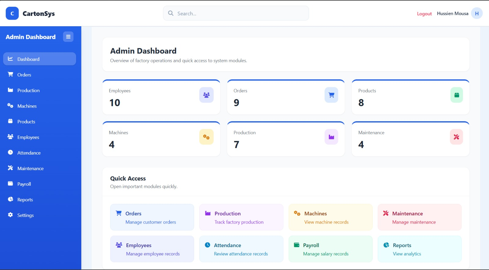

**Analytics**
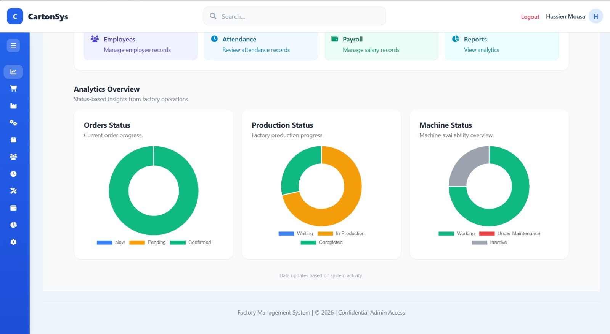

**Products**
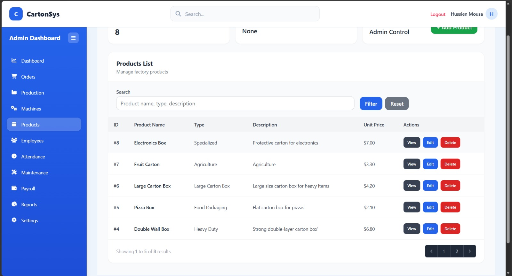

**Orders**
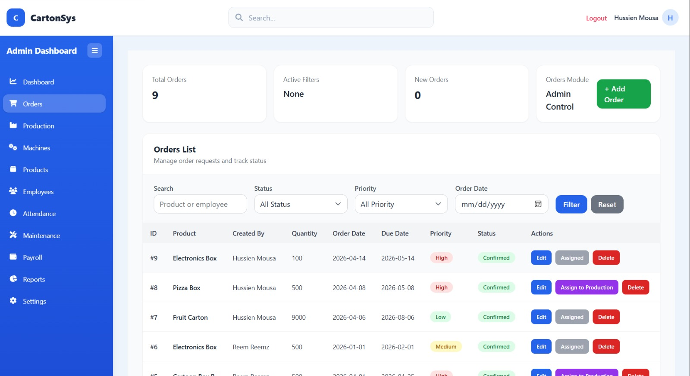

**Production**
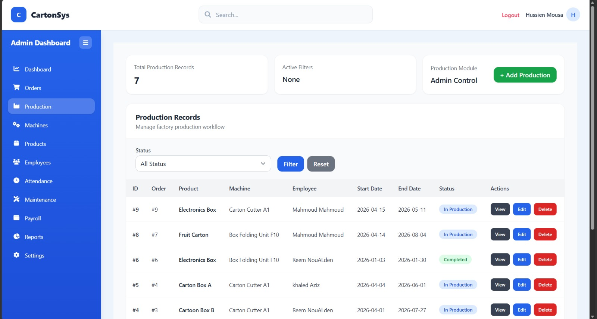

**Employees**
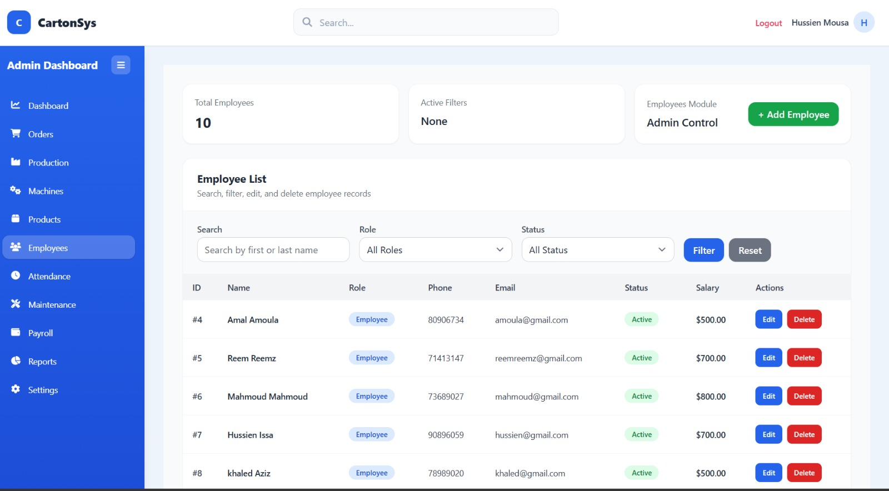

**Reports**
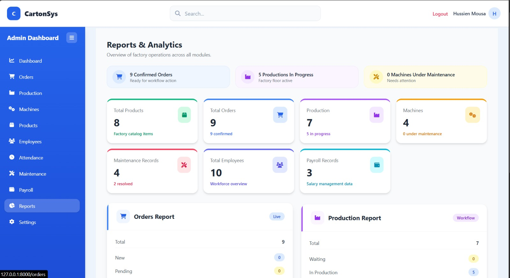

---

### 👷 Employee Panel

**Dashboard**
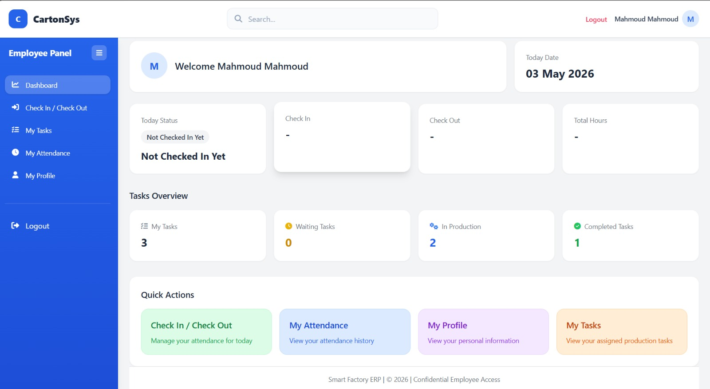

**Attendance**
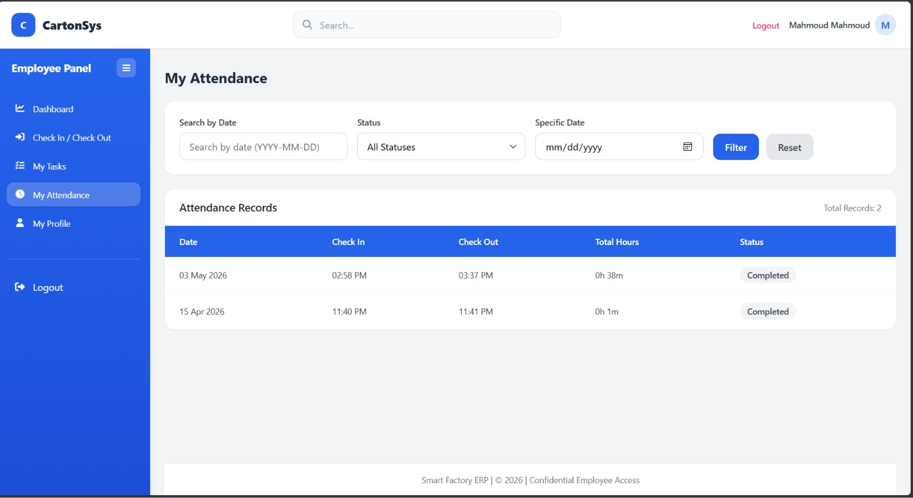

**Check In / Out**

**Tasks**
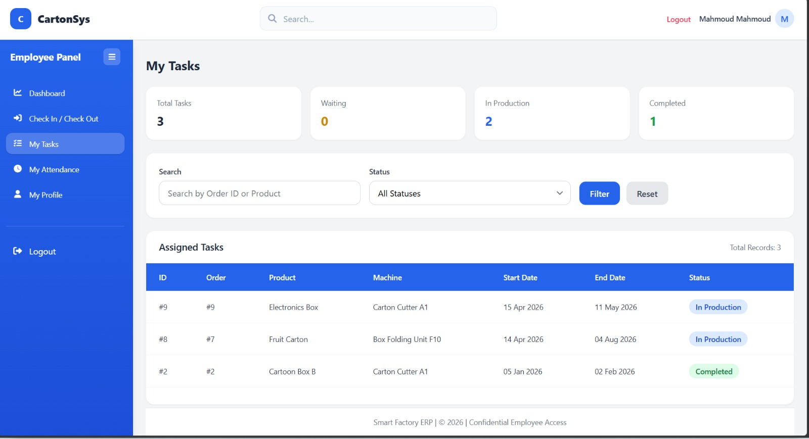

**Profile**
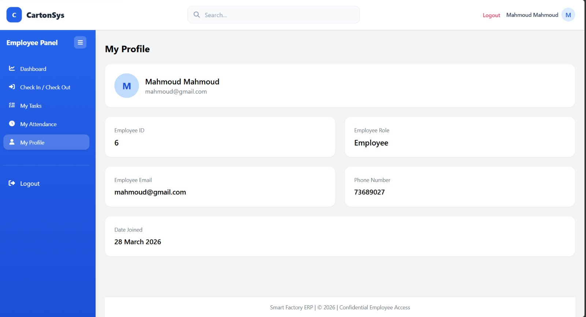

---

### 🔐 Authentication

**Login Page**
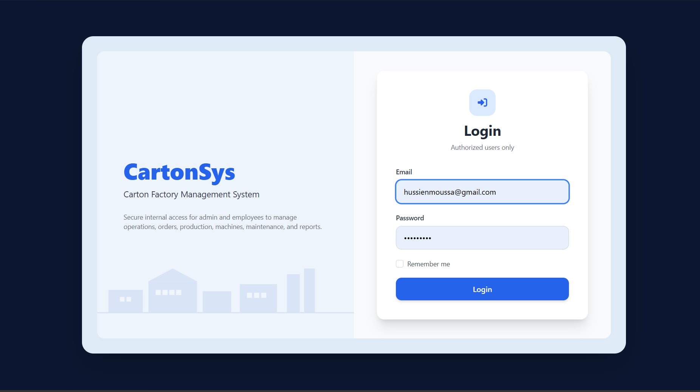

---

## ⚙️ Installation & Setup

### 1️⃣ Clone the repository
git clone https://github.com/reemsaijary/mini-erp-factory.git

### 2️⃣ Navigate to project
cd mini-erp-factory

### 3️⃣ Install dependencies

composer install

npm install

### 4️⃣ Setup environment

cp .env.example .env

php artisan key:generate

cd mini-erp-factory

## 👤 Author

**Reem Saijary**  

Computer Science Student – Final Year  

Lebanese International University  

---

## 📌 Notes

This project was developed as a **Senior Project** to demonstrate:
- Full-stack development
- System design
- Real-world ERP implementation